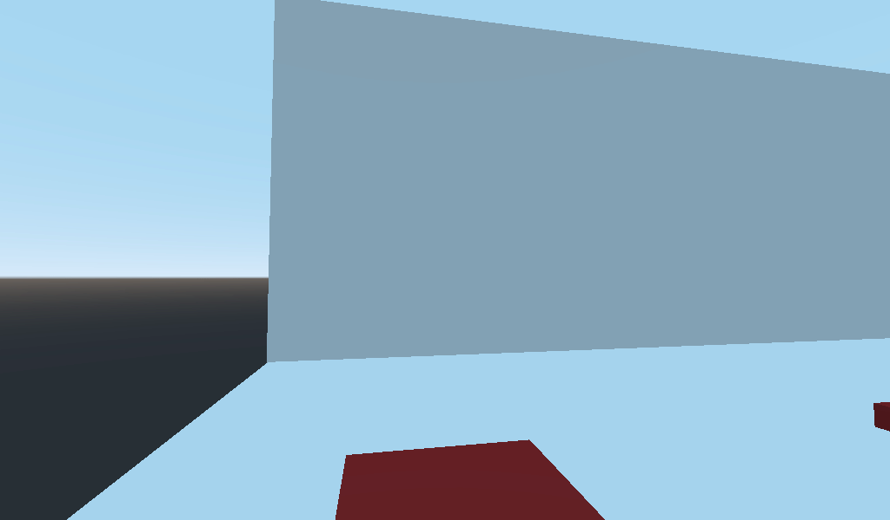

  

<h2 align="center">
Writing On The Wall 
</h2>

<i> A 3D subtitle plug-in for Godot</i>

This is a plug-in for the Godot engine that takes JSON encoded texts and uses it to display texts in 3D space. The plug-in contains triggers and displays to use in your project. Walking over triggers causes text to show up on displays. This plug-in can be used to make narrative driven games with texts displayed in 3D space (such as What Remains of Edith Finch) or to make tutorials or UI in 3D space for example.

For an example of what the plug-in can do, see this example below:

<b> How to install </b>

For more information on how to install a plug-in in Godot you can read this official documentation. It explains the process better than I ever could. 

https://docs.godotengine.org/en/stable/tutorials/plugins/editor/installing_plugins.html
